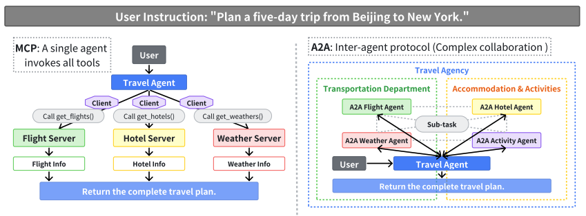

# Databricks A2A Gateway Framework


A framework for [A2A protocol](https://google.github.io/A2A/) interoperability on Databricks, powered by Unity Catalog for agent discovery and access control. Deploy an A2A gateway and let Unity Catalog handle agentic discovery, authorization, and interoperability.

For more on AI Agent Protocols, see: [A Survey of AI Agent Protocols](https://arxiv.org/pdf/2504.16736)



## What's Included

| Component | Description |
|-----------|-------------|
| **Gateway** | FastAPI app for agent discovery, authorization, and proxying |
| **Demo Agents** | Echo and Calculator agents for testing |
| **Orchestrator** | Deployable agent that discovers and calls other A2A agents |
| **Notebooks** | Interactive demos and deployment scripts |

## Architecture

```
┌─────────────────┐     ┌─────────────────┐     ┌─────────────────┐
│   User/Agent    │────▶│   A2A Gateway   │────▶│  A2A Agents     │
│                 │     │  (Databricks    │     │  (Echo, Calc,   │
│                 │     │   App)          │     │   External)     │
└─────────────────┘     └────────┬────────┘     └─────────────────┘
                                 │
                        ┌────────▼────────┐
                        │  Unity Catalog  │
                        │  (Connections)  │
                        └─────────────────┘
```

**Gateway Endpoints:**
| Endpoint | Purpose |
|----------|---------|
| `GET /api/agents` | List accessible agents |
| `GET /api/agents/{name}` | Get agent info |
| `GET /api/agents/{name}/.well-known/agent.json` | Get agent card |
| `POST /api/agents/{name}` | A2A JSON-RPC proxy (see below) |
| `POST /api/agents/{name}/stream` | A2A streaming via SSE |
| `GET /docs` | Swagger UI |

### A2A JSON-RPC Proxy

The `POST /api/agents/{name}` endpoint is a fully **A2A-compliant JSON-RPC proxy** that supports all standard A2A methods:

| Method | Description | Example |
|--------|-------------|---------|
| `message/send` | Send a message to an agent | Start a new task |
| `tasks/get` | Get task status by ID | Poll for completion |
| `tasks/cancel` | Cancel a running task | Abort long-running work |
| `tasks/resubscribe` | Resubscribe to task updates | Resume after disconnect |

**Example: Send a message**
```bash
curl -X POST "${GATEWAY_URL}/api/agents/marcin-echo" \
  -H "Authorization: Bearer ${TOKEN}" \
  -H "Content-Type: application/json" \
  -d '{
    "jsonrpc": "2.0",
    "id": "1",
    "method": "message/send",
    "params": {
      "message": {
        "messageId": "msg-1",
        "role": "user",
        "parts": [{"kind": "text", "text": "Hello!"}]
      }
    }
  }'
```

**Example: Get task status**
```bash
curl -X POST "${GATEWAY_URL}/api/agents/marcin-calculator" \
  -H "Authorization: Bearer ${TOKEN}" \
  -H "Content-Type: application/json" \
  -d '{
    "jsonrpc": "2.0",
    "id": "2",
    "method": "tasks/get",
    "params": {"id": "task-uuid-here"}
  }'
```

The gateway proxies all JSON-RPC requests to the downstream agent while enforcing Unity Catalog access control.

## Key Concepts

**Discovery Standard**:
- UC HTTP connection name ends with `-a2a` → agent is discoverable
- Connection options:
  - `host` = agent base URL (e.g., `https://agent.com`)
  - `base_path` = agent card path (e.g., `/.well-known/agent.json`)
- Gateway fetches the agent card from `host` + `base_path` and uses the `url` field for messaging

**Authorization**: Uses Databricks OBO (On-Behalf-Of) to check if the calling user/principal can access the UC connection.

**Authentication to Downstream Agents** (aligned with [A2A OAuth support](https://google.github.io/A2A/)):
| Scenario | Connection Options | Auth Method |
|----------|-------------------|-------------|
| Same Azure tenant | `bearer_token: "databricks"` | Gateway passes caller's Entra ID token |
| External (static token) | `bearer_token: "<token>"` | Gateway uses stored token |
| External (OAuth M2M) | `client_id`, `client_secret`, `token_endpoint` | Gateway acquires token via client credentials flow |

**Interoperability**: Any A2A-compliant agent can be registered (ServiceNow, Workday, custom). The gateway fetches the agent card and proxies to the endpoint URL specified in the card.

## Quick Start

**Prerequisites:** Databricks CLI configured, `make`

```bash
PREFIX=yourname
make deploy PREFIX=$PREFIX
make status
```

**Run the Demo Notebook:**

After deployment, open your Databricks workspace and navigate to:
```
/Workspace/Users/<your-email>/.bundle/a2a-gateway/dev/files/notebooks/a2a_demo.py
```

This notebook demonstrates agent discovery, messaging, and streaming using the A2A SDK.

## Register Agents

We deployed two example agents as part of this orchestration, governance setup is as follows:

**Convention**:
- Connection name ends with `-a2a` → agent is discoverable by the gateway
- `host` = agent base URL (no path)
- `base_path` = agent card path (e.g., `/.well-known/agent.json`)

```bash
# Set your prefix (same as used in make deploy); this is not required for anything other than to avoid duplicates in a workspace. Repeated for consistency.
# PREFIX=<your-prefix>

# Get agent base URLs
ECHO_URL=$(databricks apps get "${PREFIX}-echo-agent" --output json | jq -r '.url')
CALC_URL=$(databricks apps get "${PREFIX}-calculator-agent" --output json | jq -r '.url')

# Create UC connections - "databricks" indicates same-tenant Entra ID pass-through
databricks connections create --json "{
  \"name\": \"${PREFIX}-echo-a2a\",
  \"connection_type\": \"HTTP\",
  \"options\": {\"host\": \"${ECHO_URL}\", \"base_path\": \"/.well-known/agent.json\", \"bearer_token\": \"databricks\"},
  \"comment\": \"Echo Agent\"
}"

databricks connections create --json "{
  \"name\": \"${PREFIX}-calculator-a2a\",
  \"connection_type\": \"HTTP\",
  \"options\": {\"host\": \"${CALC_URL}\", \"base_path\": \"/.well-known/agent.json\", \"bearer_token\": \"databricks\"},
  \"comment\": \"Calculator Agent\"
}"

# Grant access
databricks grants update connection "${PREFIX}-echo-a2a" \
  --json '{"changes": [{"add": ["USE_CONNECTION"], "principal": "marcin.jimenez@databricks.com"}]}'
```

### External Agents (Different Tenant / No Entra ID)

For agents outside your Azure tenant, UC HTTP connections support multiple auth methods:

**Option 1: Static Bearer Token**
```bash
databricks connections create --json '{
  "name": "servicenow-a2a",
  "connection_type": "HTTP",
  "options": {
    "host": "https://myinstance.service-now.com",
    "base_path": "/api/sn_aia/a2a/id/ABC123/well_known/agent_json",
    "bearer_token": "your-static-token"
  }
}'
```

**Option 2: OAuth M2M (Client Credentials Flow)** - Recommended for A2A
```bash
databricks connections create --json '{
  "name": "workday-a2a",
  "connection_type": "HTTP",
  "options": {
    "host": "https://mycompany.workday.com",
    "base_path": "/.well-known/agent.json",
    "client_id": "your-client-id",
    "client_secret": "your-client-secret",
    "token_endpoint": "https://auth.workday.com/oauth2/token",
    "oauth_scope": "a2a.agents"
  }
}'
```

The gateway automatically acquires and caches OAuth tokens when using M2M credentials.

## Usage

First, capture the gateway URL and auth token:

```bash
# Set your prefix and Databricks host
PREFIX=marcin
DATABRICKS_HOST=https://e2-demo-field-eng.cloud.databricks.com/

# Get gateway URL and auth token
GATEWAY_URL=$(databricks apps get "${PREFIX}-a2a-gateway" --output json | jq -r '.url')
TOKEN=$(databricks auth token --host "${DATABRICKS_HOST}" | jq -r '.access_token')
```

> **Note**: If `databricks auth token` prompts for host, ensure you've logged in first:
> ```bash
> databricks auth login --host "${DATABRICKS_HOST}"
> ```

### 1. Explore the API

Open Swagger UI at `${GATEWAY_URL}/docs` to interactively test all endpoints.

### 2. Discover Accessible Agents

```bash
curl -s "${GATEWAY_URL}/api/agents" \
  -H "Authorization: Bearer ${TOKEN}" | jq
```

Response (only agents you have UC connection access to):
```json
{
  "agents": [
    {
      "name": "marcin-calculator",
      "description": "Calculator Agent",
      "agent_card_url": "https://marcin-calculator-agent-1444828305810485.aws.databricksapps.com/.well-known/agent.json",
      "url": null,
      "bearer_token": null,
      "oauth_m2m": null,
      "connection_name": "marcin-calculator-a2a",
      "catalog": "main",
      "schema_name": "default"
    },
    {
      "name": "marcin-echo",
      "description": "Echo Agent",
      "agent_card_url": "https://marcin-echo-agent-1444828305810485.aws.databricksapps.com/.well-known/agent.json",
      "url": null,
      "bearer_token": null,
      "oauth_m2m": null,
      "connection_name": "marcin-echo-a2a",
      "catalog": "main",
      "schema_name": "default"
    }
  ],
  "total": 2
}
```

### 3. Call an Agent

```bash
curl -X POST "${GATEWAY_URL}/api/agents/marcin-echo/message" \
  -H "Authorization: Bearer ${TOKEN}" \
  -H "Content-Type: application/json" \
  -d '{
    "jsonrpc": "2.0",
    "id": "1",
    "method": "message/send",
    "params": {
      "message": {
        "messageId": "msg-1",
        "role": "user",
        "parts": [{"kind": "text", "text": "Hello from A2A!"}]
      }
    }
  }' | jq
```

Response:
```json
{
  "jsonrpc": "2.0",
  "id": "1",
  "result": {
    "artifacts": [{"parts": [{"kind": "text", "text": "Echo: Hello from A2A!"}]}],
    "status": "completed"
  }
}
```

### 4. Access Denied (No UC Connection Access)

If you don't have `USE_CONNECTION` privilege, you get a **403 Forbidden**:

```bash
curl -s "${GATEWAY_URL}/api/agents/${PREFIX}-calculator/message" \
  -X POST \
  -H "Authorization: Bearer ${TOKEN}" \
  -H "Content-Type: application/json" \
  -d '{"jsonrpc":"2.0","id":"1","method":"message/send","params":{"message":{"messageId":"msg-1","role":"user","parts":[{"kind":"text","text":"Hello"}]}}}' | jq
```

Response (HTTP 403):
```json
{
  "detail": "Access denied to agent 'marcin-calculator'. Ensure you have USE_CONNECTION privilege on connection 'marcin-calculator-a2a'."
}
```

### 5. Grant/Revoke Access

Grant access:
```bash
databricks grants update connection "${PREFIX}-calculator-a2a" \
    --json '{"changes": [{"add": ["USE_CONNECTION"], "principal": "marcin.jimenez@databricks.com"}]}'
```

Now the same request succeeds. Revoke to deny:
```bash
databricks grants update connection "${PREFIX}-calculator-a2a" \
    --json '{"changes": [{"remove": ["USE_CONNECTION"], "principal": "marcin.jimenez@databricks.com"}]}'
```

### 6. Agent-to-Agent via Gateway

An agent can call other agents through the gateway. Configure your agent to use the gateway URL:

```python
# In your agent code
import os
import httpx

GATEWAY_URL = os.environ.get("GATEWAY_URL", "https://your-gateway.databricksapps.com")

async def call_calculator(expression: str):
    async with httpx.AsyncClient() as client:
        response = await client.post(
            f"{GATEWAY_URL}/api/agents/calculator/message",
            json={
                "jsonrpc": "2.0",
                "id": "1",
                "method": "message/send",
                "params": {
                    "message": {
                        "messageId": "agent-call-1",
                        "role": "user",
                        "parts": [{"kind": "text", "text": expression}]
                    }
                }
            }
        )
        return response.json()

# Agent can now use calculator if it has UC connection access
result = await call_calculator("Add 42 and 17")
```

The gateway enforces the same UC connection access for agent-to-agent calls - the calling agent's service principal must have `USE CONNECTION` privilege.

## Commands

| Command | Description |
|---------|-------------|
| `make deploy` | Deploy bundle + restart apps |
| `make status` | Check app status and URLs |
| `make stop` | Stop all apps |
| `make start` | Start all apps |
| `make destroy` | Remove all resources |

## Demo Notebooks

After deployment, run the interactive demo notebooks in your Databricks workspace:

**Location:** `/Workspace/Users/<your-email>/.bundle/a2a-gateway/dev/files/notebooks/`

### a2a_demo.py - A2A Protocol Demo

Demonstrates A2A protocol features using the official A2A SDK:
- Agent Discovery via `A2ACardResolver`
- Agent Card inspection
- Synchronous messaging via `A2AClient`
- SSE Streaming
- Multi-agent orchestration
- A2A Client as LangChain tool pattern

### a2a_agent_deploy.py - Deploy to Mosaic AI Framework

Deploys an A2A orchestrator agent to Databricks Mosaic AI Framework:
- Build agent with LangChain/LangGraph + A2A SDK tools
- Log to MLflow (models-from-code pattern)
- Register to Unity Catalog
- Deploy with `agents.deploy()`
- Creates Model Serving endpoint with autoscaling, Review App, and inference tables

### Example Prompts

**Echo Agent** - Test connectivity and message handling:
```
"Hello from A2A!"
"Test message with special chars: @#$%^&*()"
"Echo this back to me please"
```

**Calculator Agent** - Arithmetic operations:
```
"Add 15 and 27"
"Multiply 6 by 7"
"Divide 100 by 4"
"What is 25 times 4?"
```

**Combined Multi-Agent Workflow**:
```python
# 1. Discover available agents
agents = list_agents()

# 2. Verify connectivity with Echo
echo_response = send_message("marcin-echo", "System check")

# 3. Perform calculation
calc_response = send_message("marcin-calculator", "Multiply 1250 by 12")

# 4. Use streaming for real-time feedback
stream_message("marcin-calculator", "Add 100 and 200")
```

### Assistant Agent (Optional)

The Assistant Agent is an orchestrator that can discover and use other agents automatically. To deploy it, uncomment the `assistant_agent` section in `databricks.yml` and redeploy.

**Example prompts for Assistant Agent:**
```
"What agents are available?"
"Calculate 15 plus 27 for me"
"Echo hello world"
"First discover agents, then calculate 100 divided by 5"
```

## Service Principal Authentication

For programmatic/automated access to the A2A Gateway and agents from notebooks or scripts, use a Service Principal instead of user OAuth tokens.

See **[notebooks/README.md](notebooks/README.md#programmatic-access-with-service-principals)** for detailed instructions on:
- Creating a Service Principal
- Generating OAuth secrets
- Granting app and UC connection access
- Using `WorkspaceClient` with SP credentials

## Testing

```bash
make test PREFIX=$PREFIX
```

See [tests/README.md](tests/README.md) for details.

## Experimental Features

### MLflow Tracing (Unity Catalog)

Trace all gateway requests with rich metadata including agent, user, and gateway context. Traces are stored in Unity Catalog Delta tables for analysis and monitoring.

**Configuration** (`gateway/app.yaml`):
```yaml
env:
  - name: TRACING_ENABLED
    value: "true"
  - name: MLFLOW_EXPERIMENT_NAME
    value: "/Shared/a2a-gateway-traces"
  - name: TRACE_UC_SCHEMA
    value: "a2a.gateway"
```

**Required Setup** (handled automatically by DAB):
1. MLflow experiment `/Shared/a2a-gateway-traces` with app service principal permissions
2. Unity Catalog `a2a` with `USE_CATALOG` grant
3. Schema `a2a.gateway` with `USE_SCHEMA`, `CREATE_TABLE`, `SELECT`, `MODIFY` grants

The experiment must exist before the app starts (app will fail fast if not found).

**Trace Tags**:
| Tag | Description |
|-----|-------------|
| `gateway.version` | Gateway version |
| `gateway.environment` | Environment (dev/staging/prod) |
| `gateway.instance_id` | Unique gateway instance ID |
| `request.id` | Unique request correlation ID |
| `request.type` | Request type (gateway/agent_proxy) |
| `user.email` | Caller's email (from OBO headers) |
| `agent.name` | Target agent name |
| `agent.method` | A2A method called |

**Optional**: Set `MLFLOW_TRACING_SQL_WAREHOUSE_ID` for production monitoring queries.

**Reference**: [Databricks MLflow Tracing with Unity Catalog](https://docs.databricks.com/aws/en/mlflow3/genai/tracing/trace-unity-catalog)

## Known Issues

| # | Issue | Status |
|---|-------|--------|
| 0 | Need to fix FastAPI doc | Tracked internally |
| 1 | OAuth token manual passthrough required for OBO auth from Databricks notebooks to Databricks Apps | Tracked internally |
| 2 | Enable agent discovery without requiring `-a2a` suffix on connection names | Open (non-blocking) |
| 3 | Fix swagger documentation to support OAuth token injection from the UI via OBO | Open (non-blocking) |
| 4 | Move standardized functions for agent discovery and usage to UC functions with Agent Framework and OBO | Open (non-blocking) |
| 5 | Streamline configuration: consolidate duplicate settings across `app.yaml`, `databricks.yml`, and `Makefile` (catalog names, schema names, prefixes) into a single source of truth | TODO |