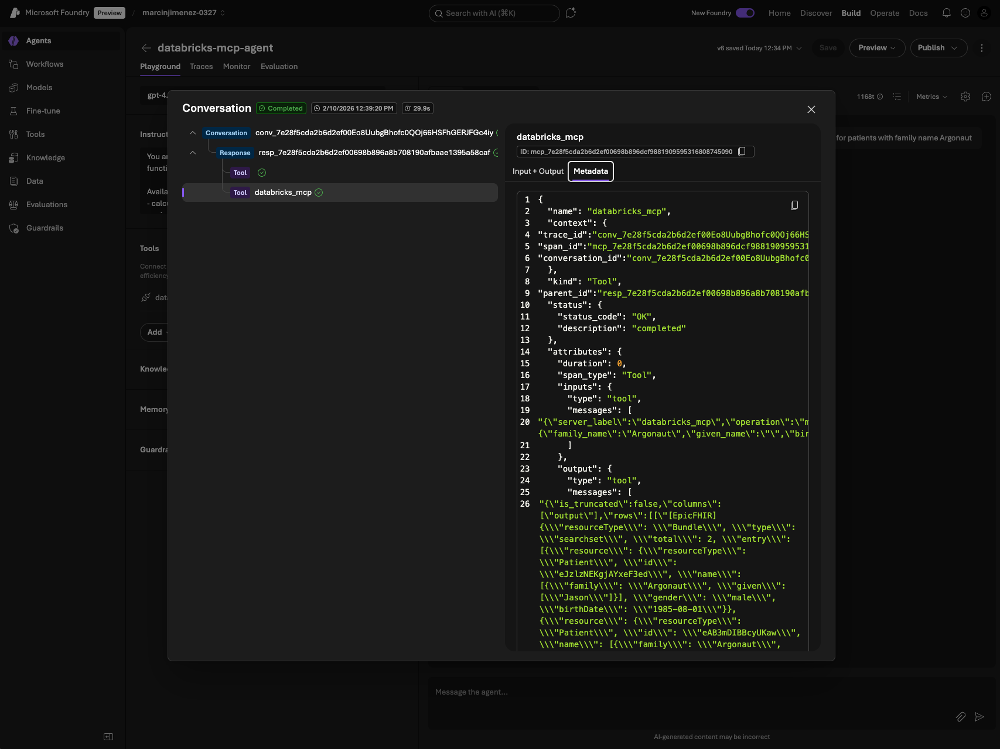

# Azure AI Foundry + Databricks MCP Integration

This guide shows how to connect Azure AI Foundry agents to Databricks Unity Catalog functions via MCP (Model Context Protocol) using OAuth authentication.



## Prerequisites

- Azure AI Foundry project (Foundry 2.0 / nextgen)
- Databricks workspace with Unity Catalog
- UC functions registered in a catalog/schema (e.g., `mcp_agents.tools`)

## Setup Steps

### 1. Create Databricks OAuth App

1. Go to **Databricks Account Console**: https://accounts.azuredatabricks.net
2. Navigate to **Settings** > **App Connections** > **Add connection**
3. Configure:
   - **Name**: `foundry-mcp-oauth`
   - **Redirect URLs**: Leave empty for now (will add after step 2)
   - **Generate client secret**: Check this box
   - **Scopes**: `all-apis`
4. Click **Add**
5. **Save the Client ID and Client Secret** - you'll need these

### 2. Create Connection in Azure AI Foundry

1. Go to **Azure AI Foundry**: https://ai.azure.com
2. Open your project
3. Navigate to **Management** > **Connected resources** > **New connection**
4. Select **Custom** > **MCP**
5. Configure:
   - **Name**: `databricks-oauth`
   - **Endpoint**: `https://<your-workspace>.azuredatabricks.net/api/2.0/mcp/functions/<catalog>/<schema>`
   - **Authentication**: OAuth2
   - **Client ID**: From step 1
   - **Client Secret**: From step 1
   - **Authorization URL**: `https://<your-workspace>.azuredatabricks.net/oidc/v1/authorize`
   - **Token URL**: `https://<your-workspace>.azuredatabricks.net/oidc/v1/token`
   - **Refresh URL**: `https://<your-workspace>.azuredatabricks.net/oidc/v1/token`
   - **Scopes**: `all-apis`
6. Click **Add**
7. **Copy the Redirect URL** that Foundry provides

### 3. Update Databricks OAuth App with Redirect URL

1. Go back to **Databricks Account Console**
2. Find your OAuth app (`foundry-mcp-oauth`)
3. Click **Edit**
4. Add the **Redirect URL** from step 2
5. Click **Save**

### 4. Configure Environment

Update your `.env` file:

```bash
AZURE_AI_PROJECT_ENDPOINT=https://<resource>.services.ai.azure.com/api/projects/<project>
MCP_PROJECT_CONNECTION_NAME=databricks-oauth
MODEL_DEPLOYMENT_NAME=gpt-4.1
```

### 5. Test Locally

```bash
make test-mcp-local
```

On first run:
1. You'll see an OAuth consent URL
2. Open the URL in your browser
3. Complete the Databricks authorization
4. Run the test again - MCP tools should work

### 6. Deploy Agent to Foundry Portal

```bash
make deploy-mcp-agent
```

This creates a persistent agent in Foundry that you can test in the portal with full tracing.

To delete the agent:
```bash
make delete-mcp-agent
```

## OAuth URLs Reference

| Field | Format |
|-------|--------|
| Authorization URL | `https://<workspace>.azuredatabricks.net/oidc/v1/authorize` |
| Token URL | `https://<workspace>.azuredatabricks.net/oidc/v1/token` |
| Refresh URL | `https://<workspace>.azuredatabricks.net/oidc/v1/token` |
| Scopes | `all-apis` |

## Makefile Commands

| Command | Description |
|---------|-------------|
| `make test-mcp-local` | Test MCP connection locally (runs 3 tests) |
| `make deploy-mcp-agent` | Deploy MCP-enabled agent to Foundry portal |
| `make delete-mcp-agent` | Delete MCP-enabled agent from Foundry portal |
| `make deploy-simple-agent` | Deploy simple chat agent (for UC Function demo) |
| `make delete-simple-agent` | Delete simple chat agent |

## Simple Chat Agent

The `simple-chat-agent` is a basic conversational agent deployed to Foundry that can be called from Databricks UC Functions. This demonstrates **agent-to-agent interoperability** - calling a real Foundry Agent from Databricks.

To deploy:
```bash
make deploy-simple-agent
```

This agent is called by the `foundry_agent` UC Function registered by the notebook. The UC Function handles the full Agents API flow (threads, messages, runs) to call the Foundry Agent.

## Local Test Details

The local test (`make test-mcp-local`) runs 3 tests:

1. **TEST-1**: Direct MCP call to Databricks (bypasses Foundry)
2. **TEST-2**: Azure AI Project client connection
3. **TEST-3**: Responses API with agent + MCP tools

## Troubleshooting

### OAuth consent not appearing
- Verify the connection auth type is `OAuth2`
- Check that authorization/token URLs are correct

### 401 Unauthorized after consent
- Ensure redirect URL in Databricks OAuth app matches Foundry's redirect URL
- Verify scopes include `all-apis`

### Connection not found
- Check `MCP_PROJECT_CONNECTION_NAME` matches your connection name in Foundry

## Documentation

- [Databricks MCP External Clients](https://learn.microsoft.com/en-us/azure/databricks/generative-ai/mcp/connect-external-services)
- [Foundry MCP Authentication](https://learn.microsoft.com/en-us/azure/ai-foundry/agents/how-to/mcp-authentication)
