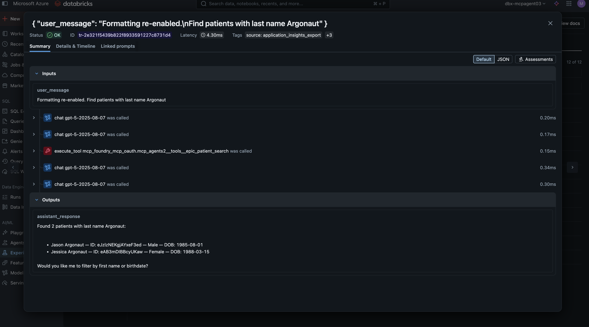

# Notebooks

## register_uc_functions.py

Registers Unity Catalog Functions that wrap external agents (Calculator, Foundry, Epic FHIR) as MCP tools. Run this after `make deploy-uc`.

## foundry_traces_to_mlflow.py

Imports Azure AI Foundry agent telemetry from Application Insights into MLflow as traces. Reads NDJSON exports from blob storage, reconstructs the span tree (Conversation → Response → Tool calls), and logs them with original timestamps.

**Setup:** This notebook requires manual configuration — it is not part of the automated deployment pipeline. You need:

1. An Application Insights diagnostic export to blob storage (`insights-logs-appdependencies` container)
2. A Unity Catalog external location granting access to the storage container
3. `SUBSCRIPTION_ID`, `PREFIX`, and `RESOURCE_GROUP` set in `notebooks/.env`

